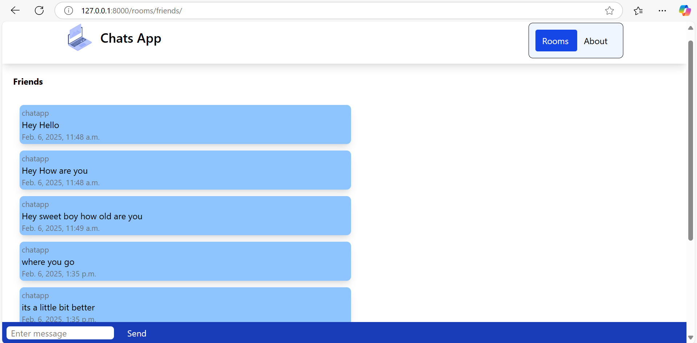
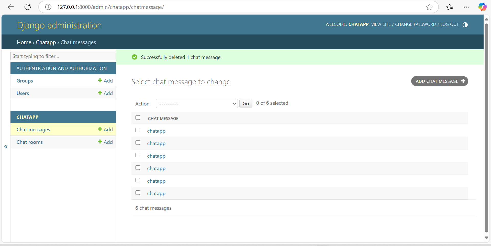

# ChatApp

A real-time chat application built with Django, featuring an admin panel for managing chat messages and chat rooms. This project demonstrates the implementation of message functionalities, user interface designs, and Django administration tools.

## Features

- Real-time messaging between users
- User-friendly interface for chat interactions
- Admin panel to manage chat rooms and messages
- Message deletion and moderation functionalities
- Clean and responsive UI

## Installation

### Prerequisites
Ensure you have the following installed on your system:
- Python 3.x
- Django
- Git (optional)

### Setup Instructions

1. Clone the repository:
   ```bash
   git clone https://github.com/CoderMahruf/Chat-App.git
   ```
2. Navigate to the project directory:
   ```bash
   cd mysite
   ```
3. Install required dependencies:
   ```bash
   pip install -r requirements.txt
   ```
4. Apply migrations:
   ```bash
   python manage.py migrate
   ```
5. Create a superuser to access the admin panel:
   ```bash
   python manage.py createsuperuser
   ```
6. Start the development server:
   ```bash
   python manage.py runserver
   ```

## Usage

1. Visit `http://127.0.0.1:8000` to access the chat application.
2. Navigate to the admin panel at `http://127.0.0.1:8000/admin` to manage chat messages and rooms.
3. Log in as the superuser to add, edit, or delete chat messages.


## Admin Panel

To access the admin panel:
1. Go to `http://127.0.0.1:8000/admin`
2. Log in with the superuser credentials.
3. Manage chat rooms and messages as needed.

## Screenshots

### Chat Interface  
  

### Admin Panel  
  

## License
This project is licensed under the [MIT License](LICENSE).

